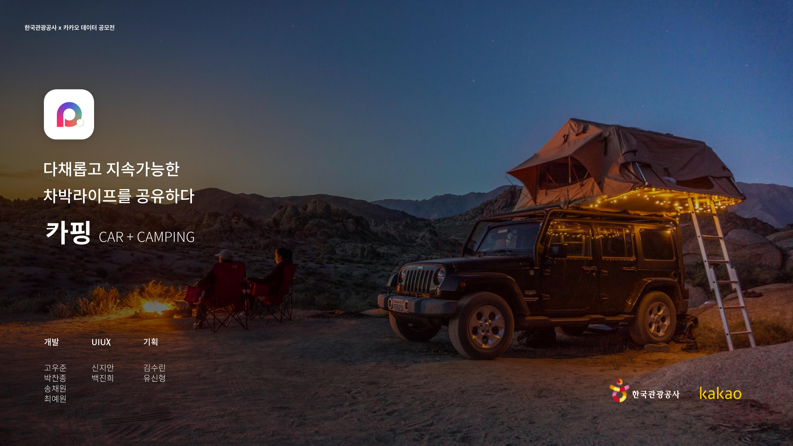
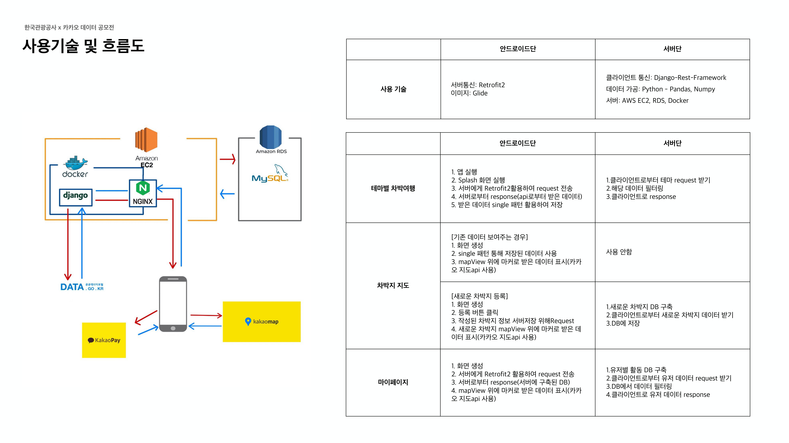

# 카핑 (Carping)



# Server Environment

### - Python 3.7

### - Django 3.2.5

### - Django-Rest-Framework 3.12.4

### - MariaDB

### - Docker

### - AWS EC2

### - AWS RDS

### - Nginx

# Used Data List

### [한국관광공사\_고캠핑 정보조회 서비스](https://www.data.go.kr/tcs/dss/selectApiDataDetailView.do?publicDataPk=15063201)

### [한국관광공사 생태관광 정보](https://www.data.go.kr/data/15016069/openapi.do)

### [한국관광공사\_국문 관광정보 서비스](https://www.data.go.kr/data/15057787/openapi.do)

# Technical Flow



## Base Setting

```
pip install -r requirements.txt

python manage.py test
```

## Docker

```
docker-compose up --build -d
```
