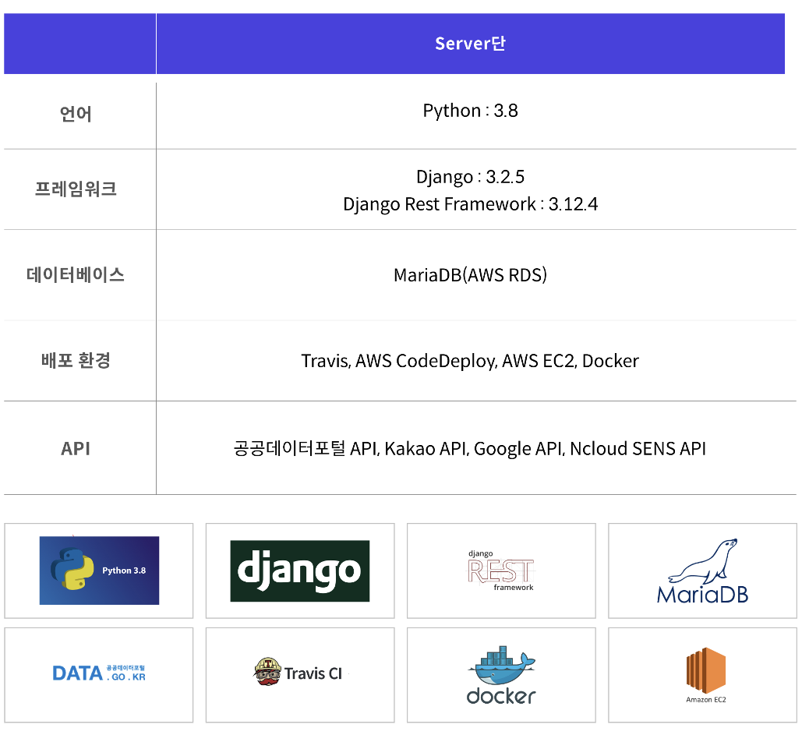
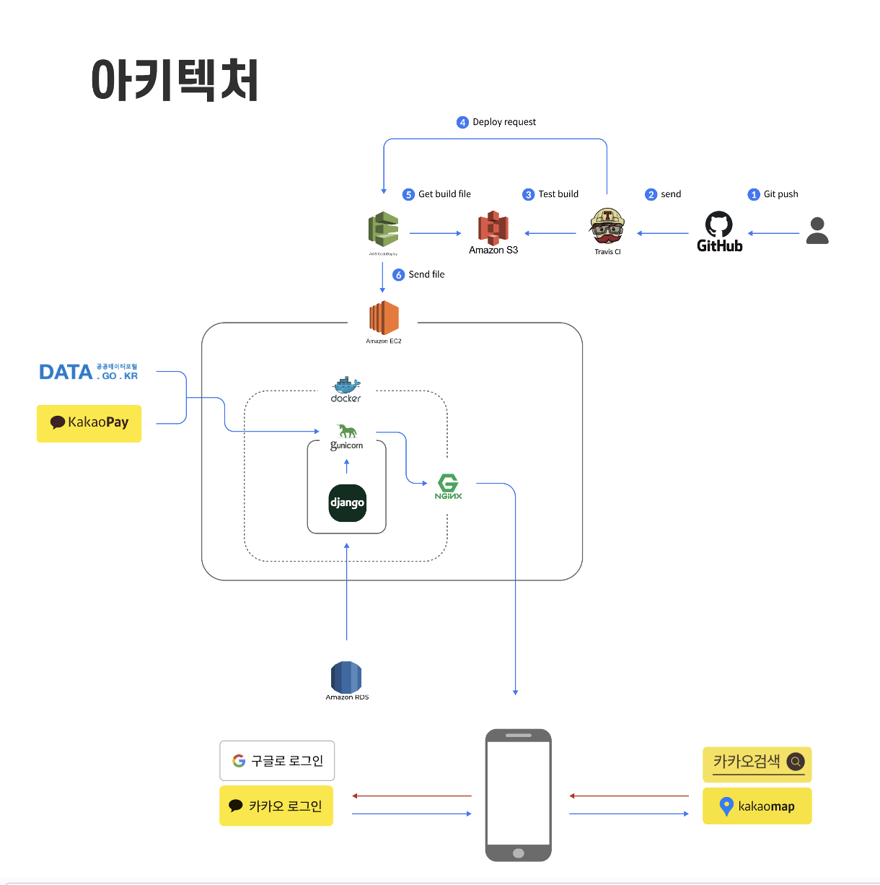
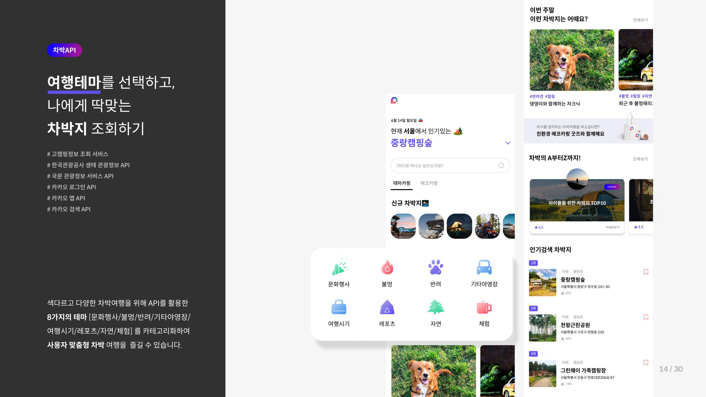
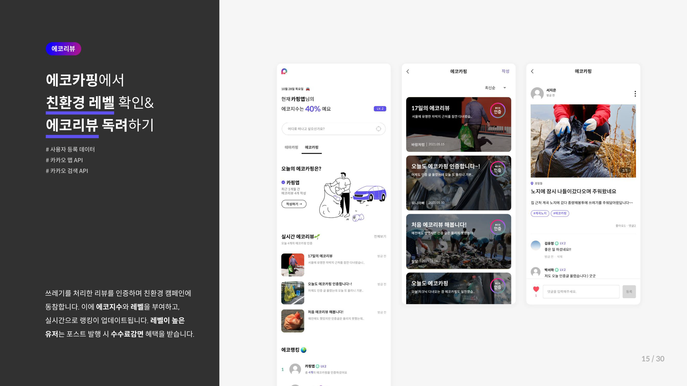
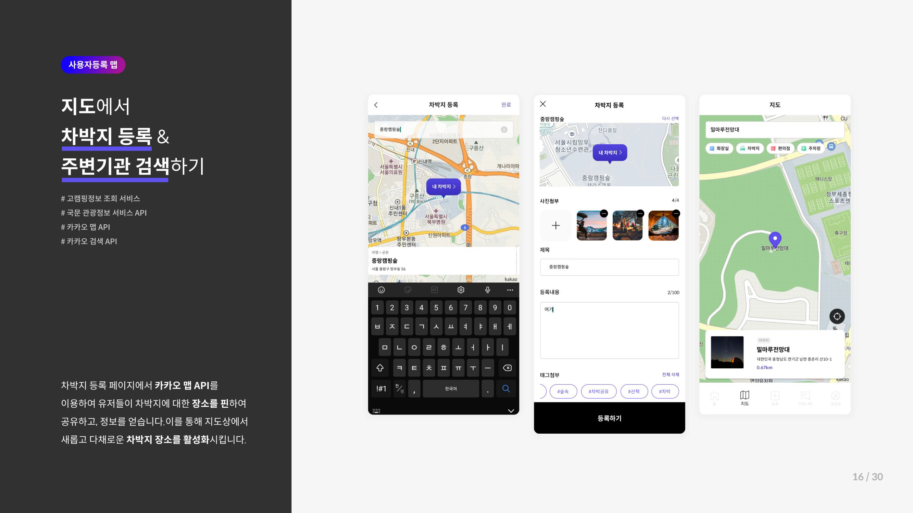
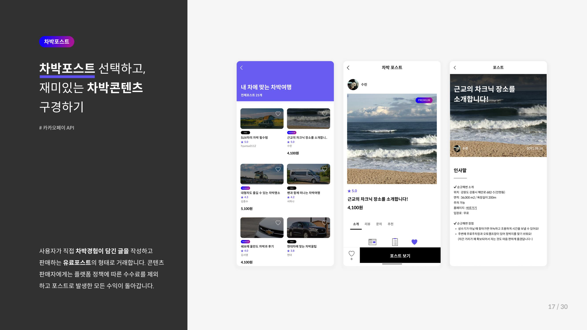
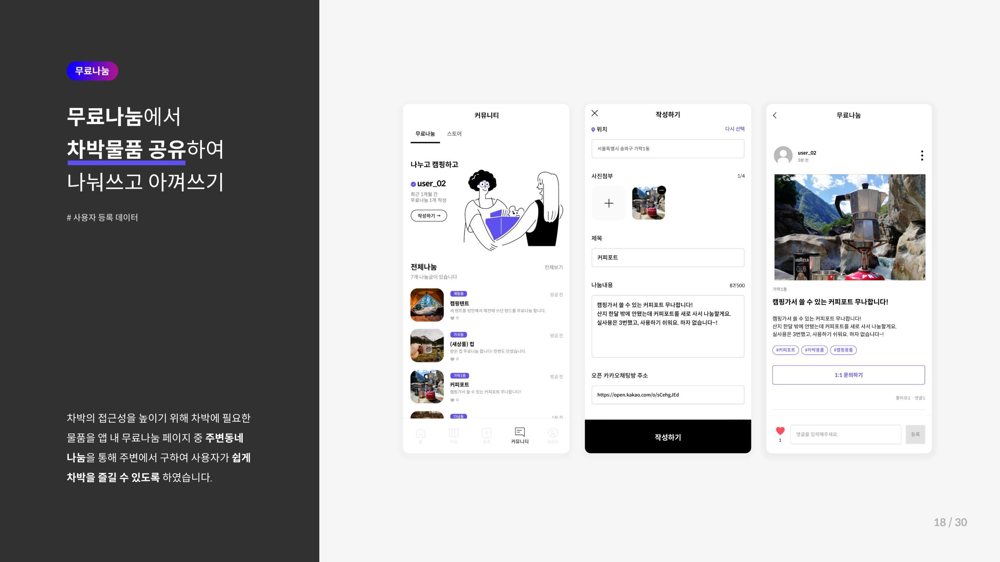
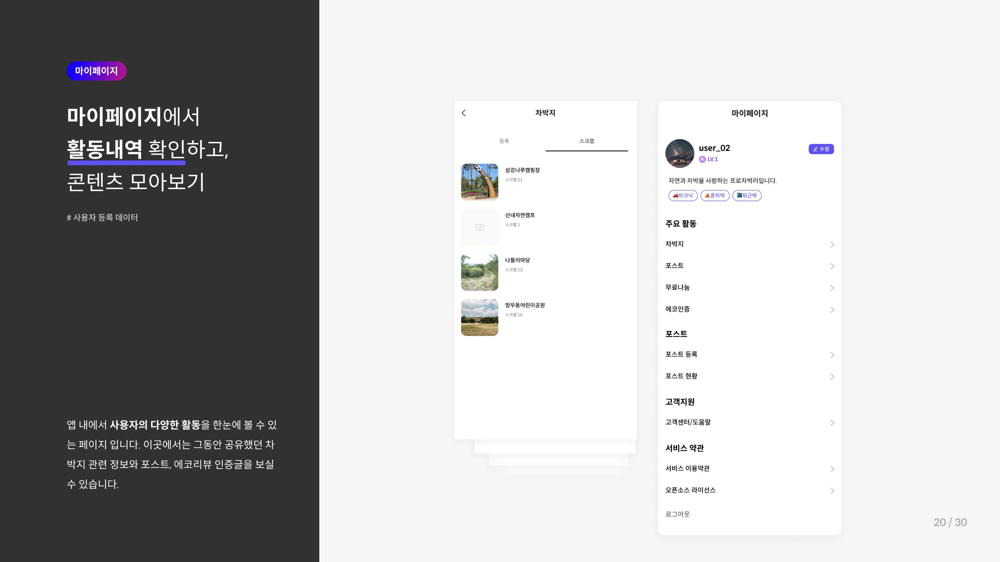

# Server Environment





# Service Information









# Base Setting

```
pip install -r requirements.txt
python manage.py runserver --settings=carping.settings.development
```

# Docker

```
docker-compose up --build -d
```
